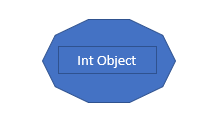
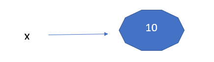

# 
 <h3>Variables In Python and Its Nature</h3> 

A variable is a value that can change, depending on conditions or on information passed to the program.

 In python we do not need to declare variable before using them ( _there are no declarations_ )      

> ## Variable Assignment
<strong>Assignment statements can be plain or augmented</strong>

Plain assignment is to a variables is how we create a new varible.

<h3 style="color:green;"> Plain Assignment: </h3>
<code>
x = 10 | <i>This is read as "x assigned value 10"</i>  
</code>

Python also supports chain assignment, which is assign same value to multiple variables.  
<code>x = y = z = 100</code>

`print(x, y, z)` #results x = 100, y =  100, z = 100

assign values to multiple variables in one line:  
`x, y, z = "Orange", "Banana", "Cherry"` #results x = Orange, y = Banana, z = Cherry

<h3 style="color:green;"> Augmented Assignment: </h3>

In augmented assignment we use augmented operator(+, -, etc) followed by assignment operator(=) instead of only assignment operator(=) between target and expression.

`x += 10`

`x += y`

Augmented assignment doesn't support chain assignments.

>## Variable Types

In most of the programming languages, variables are statically typed. Which means we have to declare variable type before assignment. Like in C:   <code> int x;  x = 10 or int x = 10; </code> so x is now assigned as integer type variable and the value assigned to the variable can't not be changed, we can not re-assign different type value to it. ( x = "String" is not allowed as value is string and variable type is integer) 

In python variables are not statically typed its means we can assign a integer value to it  
<code> x = 10 </code>  
and then we can re-assign to variable x a string string value  
`x = 'string'`  
Now the question arises how does python handle assignments?

Python is highly object-oriented, virtually every data item in python is an object of a type or class. For example, think of `x = 10` assigning the integer 10 to x at this time 3 things happen.

1. Creates an integer object

2. Gives it the value 10

3. Sets name `x` to hold the reference to the object

Now if look at the type of the variable:

`x = 100`

`print( type(x) )`

`<class 'int'>`

Now re-assigning a "string" to x

`x = 'Hello'`

`print(type(x))`

`<class 'str'>`

So its proves that `x` is just holding an object reference.

> Object Identity

Whenever an object is created in python, a unique integer is given to identify it.

Built-in 